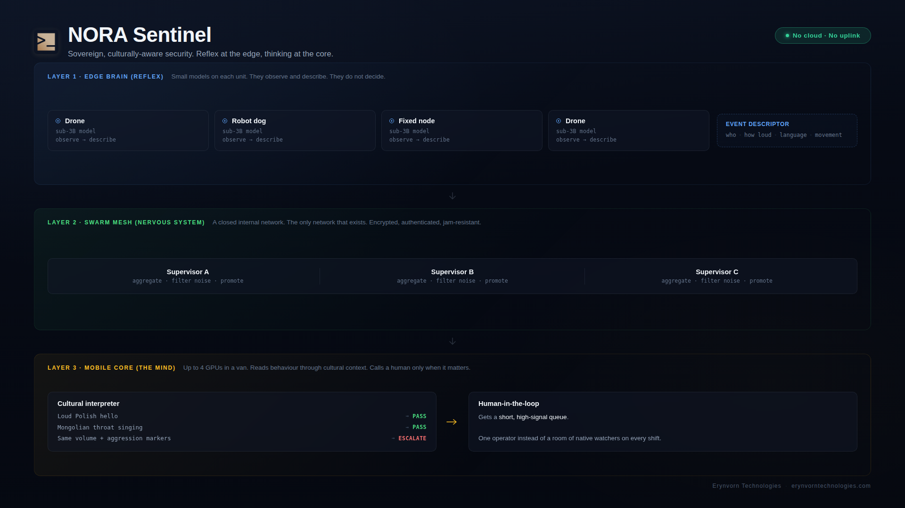

# NORA Sentinel

**Sovereign, culturally-aware edge AI for crowd and perimeter security.**
An autonomous agent swarm that reads not just *what* people do, but *what it means in their culture*, so human operators are called only when it actually matters.

By [Erynvorn Technologies](https://erynvorntechnologies.com). Part of the N.O.R.A. family.



---

## The problem nobody is solving

Threat detection is a commodity. Object detection, face detection, weapon detection, crowd density: it is everywhere, and it has been done well for years. That is not where the pain is.

The pain is **false positives across cultures**. A security stack trained on one culture's baseline flags the wrong things everywhere else:

- Six men speaking loud, overlapping Polish at close range read as "escalating fight" to a system tuned on quieter norms. It is usually just how the conversation sounds.
- A group from Mongolia performing throat singing reads as an aggression signal. It is a love song.

At an event with 50 nationalities, that noise is the whole game. Every false positive is either a wasted response team or a real signal buried in the alarms.

## What NORA Sentinel does differently

It puts a **cultural interpretation layer** between raw perception and human operators. Perception says *what happened*. NORA Sentinel decides *what it means, given who these people are*, and returns one of three verdicts:

`pass` &nbsp;|&nbsp; `monitor` &nbsp;|&nbsp; `escalate_HITL`

The result: one interpreter that lets a small human-in-the-loop team cover a crowd that would otherwise need dozens of native-speaking watchers on every shift. You need the native experts once, for a year, to build it. Not forever, on rotation.

## Three layers

1. **Edge brain (reflex).** Every moving unit (drone, robot dog, fixed node) carries a small on-board model. It does not reason. It sees and describes: who, how loud, what language, what movement, how close. Output is a structured event descriptor.
2. **Swarm mesh (nervous system).** A closed internal network between units. This is the *only* network that exists. Supervisors live here: they aggregate, filter, and escalate.
3. **Mobile core (reasoning).** The "mind" of the swarm, up to 4 high-end GPUs in a transmission van. Here lives the manager (the interpreter) and the path that harnesses the whole cohort's compute for one hard case.

Reflex at the edge, thinking at the core.

## Operational sovereignty

Most "sovereign AI" means your data stays in your building. NORA Sentinel goes further: **it needs no building, no cloud, and no external network at all.** The swarm thinks inside itself. The core can sit in a van in a field with zero connectivity.

No external uplink means **no remote attack surface**: there is no remote entrance to defend because there is no remote entrance. The internal RF mesh is still treated as hostile-adjacent: it is encrypted, authenticated, and hardened against jamming and spoofing. That is a designed property of the swarm, documented in [`docs/threat-model.md`](docs/threat-model.md), not an afterthought.

## What is in this repo

| Path | What it holds |
|---|---|
| `docs/architecture.md` | The three layers in detail, and the hardware targets |
| `docs/decision-flow.md` | How an event travels from edge to verdict, with escalation |
| `docs/threat-model.md` | The air-gapped swarm security model |
| `docs/cultural-interpreter.md` | The differentiator: event and verdict schema, worked examples |
| `docs/gitex-demo.md` | The live demo script and talking points |
| `config/train.example.yaml` | Config-as-code training recipe |
| `scaffold/` | Portable training scaffold: the same recipe runs on one GPU or a cluster |
| `demo/` | Runnable skeleton: cultural interpreter plus a mock swarm |
| `data/` | Dataset format and curation guidance |

## Status

This is an active build, in the open.

- Reference architecture: **defined**.
- Training scaffold: **working** (portable, dev on a single GPU, burst to a cluster unchanged).
- Cultural interpreter: **runs today** on a base model or a transparent rule-based stub, so the demo works before fine-tuning. It gets sharper as the curated dataset grows.
- Agent swarm: **runnable skeleton** (manager, supervisors, mock edge workers, message bus) that maps one-to-one onto real edge hardware later.

Nothing here is a slide. It runs.

## What this repo is, and what it is not

This repo is the **architecture and the proof**, published so your engineers can validate the thinking before anyone signs anything.

**It is:** the full reference architecture, a running demo, a portable training scaffold, and a first model trained end to end on a single GPU. Enough for a technical team to confirm in an afternoon that the design is sound and that it actually runs.

**It is not:** the production system. By design, the hard, paid parts are not in here: the native-reviewed cultural dataset and the trained interpreter weights (the moat), the CV and audio perception layer (commodity, integrated per deployment), and the real RF mesh transport and edge hardware drivers. The model in here is trained on synthetic bootstrap data to prove the pipeline, not to ship.

So you validate that it makes sense and that it can be built. You do not get a finished product for free. That line is deliberate.

## From repo to deployment

The wheel is already built. With a budget, deployment is integration, not invention:

- The training scaffold already runs the same recipe on one GPU or a full cluster, unchanged. Scaling the model up is a one-line change, not a rewrite.
- The swarm skeleton (manager, supervisors, edge workers, message bus) maps one-to-one onto real units. We swap the mock transport for the RF mesh and the mock feed for real perception; the logic is already there.
- The cultural interpreter is a drop-in: point it at the trained weights and the swarm uses it immediately, no code change.

What a funded engagement adds, in order: curate the native-reviewed dataset, train the real interpreter (3-4B), integrate perception, and provision the edge hardware. Every one of those plugs into a socket that already exists in this repo. Nobody starts from a blank page, so the path from "validated" to "running on your site" is short.

## Quickstart (demo)

```bash
# from the repo root, with the scaffold venv active (see scaffold/README.md)
python demo/swarm/run_demo.py
```

It replays the scenarios in `demo/interpreter/scenarios.jsonl` through the swarm and prints the verdict and the cultural reasoning for each.

## Who this is for

Event security, critical-perimeter and crowd-safety operators who work across cultures, and defense or field deployments with no reliable connectivity. Dual-use by design: the same stack serves a stadium and a transmission van.

## Author

Kamil Nagorski, Erynvorn Technologies. https://kamilnagorski.co.uk
